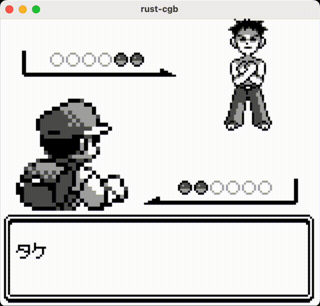

# Game Boy Emulator

A Game Boy and Game Boy Color emulator implemented in Rust.

## Overview

This project is a Game Boy and Game Boy Color emulator written in Rust that emulates the hardware of the original consoles. It includes implementations of the CPU, memory bank controllers (MBC), audio processing unit (APU), and other core components necessary to run games accurately.

## Gameplay Examples
  
   

## Features

- **CPU Emulation**: Accurate emulation of the custom 8-bit CPU of the Game Boy and Game Boy Color.
- **Graphics Emulation**: Support for the LCD controller and pixel rendering, including extended color features for the Game Boy Color.
- **Audio Emulation**: Implementation of the APU, including:
  - Two pulse channels with duty cycles and envelope features.
  - Wave channel for custom waveform audio.
  - Noise channel for generating pseudo-random noise.
- **Memory Bank Controllers**: Support for MBC1, MBC2, MBC3, and MBC30, including ROM and RAM banking.
- **Real-Time Clock (RTC)**: Emulation of the RTC functionality provided by MBC3 for time-based events.
- **Input Handling**: Emulation of the Game Boy's button inputs.
- **Game Boy Color Support**:
  - Support for the extended CPU instruction set.
  - Full-color graphics emulation.
  - Implementation of double-speed mode.
- **Link Cable Functionality**: Support for link cable communication with other emulators over the network.
- **Cross-Platform**: Runs on any system that supports Rust.

## Software Compatibility

Below is a list of games and their startup status on this emulator.

| Game Title                                | Game Boy | Game Boy Color |
| ----------------------------------------- | -------- | -------------- |
| Pokémon Silver                            | OK       | OK             |
| Pokémon Red                               | OK       | NG             |
| Dragon Quest Monsters 2: Tara's Adventure | NG       | OK             |
| Game Boy Gallery                          | OK       | NG             |
| Medarot 2 Parts Collection                | NG       | OK             |
| Medarot 3                                 | NG       | OK             |
| Pokémon Crystal                           | NG       | NG             |
| Tetris                                    | OK       | NG             |
| Yu-Gi-Oh! Duel Monsters 3                 | NG       | OK             |

## Usage

### Prerequisites

- Rust and Cargo should be installed.

### Basic Example
 ```bash
cargo run --release -- --listen-port 12345 --send-port 12346 --file-path path/to/rom.gb
```
The emulator requires the following command-line arguments.

#### Required Options

- `--listen-port <port number>`: Specify the port number to listen for link cable communication.
- `--send-port <port number>`: Specify the port number to connect to for link cable communication.
- `--file-path <path to ROM>`: Specify the path to the ROM file you wish to run.

#### Option Flags
- `--gb`: Run the emulator in Game Boy mode. If not specified, the emulator defaults to Game Boy Color mode.

#### Option Details

- **`--listen-port`** (Required):  
  Specifies the port number to listen for incoming link cable connections. This option **must** be specified.

- **`--send-port`** (Required):  
  Specifies the port number of the other emulator to connect to for link cable communication. This option **must** be specified.

- **`--file-path`** (Required):  
  Specifies the path to the Game Boy or Game Boy Color ROM file you wish to run.

- **`--gb`**:  
  When this flag is specified, the emulator runs in Game Boy mode. This option is not needed for Game Boy Color-only software.

#### Notes

- `--listen-port` and `--send-port` are **required options** and must be specified.
- When using link cable communication, ensure both emulators specify appropriate port numbers.
- Depending on your network environment, you may need to configure your firewall or router to open the specified ports.

### Keyboard Controls

- **Arrow Keys**: D-Pad (Directional buttons)
- **Z Key**: A Button
- **X Key**: B Button
- **Enter Key**: Start Button
- **Shift Key**: Select Button

### TODO

- **Debugging Communication Functionality**: Improve the stability of the link cable communication feature.
- **Debugging Noise Channel**: Fix issues related to the noise channel in the APU.
